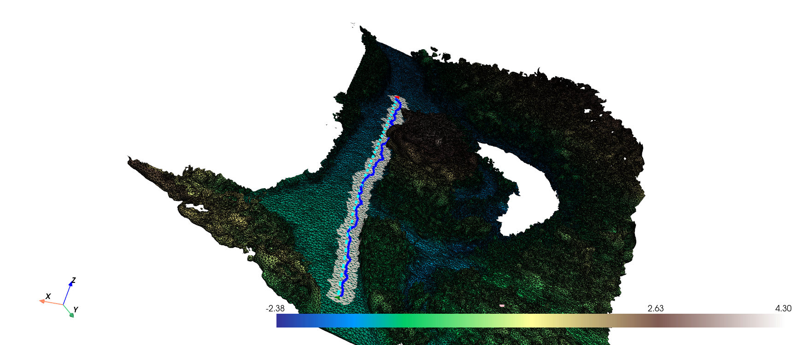

# Terrain Path Planner Visualization

This project provides a visualization tool for terrain path planning using different kinodynamic planners.

## Installation

1. **Clone the Repository:**

    ```bash
    git clone https://github.com/Stblacq/visualize_mesh
    cd terrain-path-planner
    ```

2. **Setup Installation:**

    Make sure you have Python installed. Then, install the required dependencies using `pyproject.toml`.

    ```bash
    pip install .
    ```

## Running Examples

### Simple Example

1. **Run the Simple Example:**

    ```bash
    python -m visualize.__init__ simple
    ```

### Large Example

1. **Run the Large Example:**

    ```bash
    python -m visualize.__init__ large
    ```

## Structure

- `visualize/`
  - `miki_planner.py`: Contains the `mixed_integer_kinodynamic_planner` function.
  - `pruned.py`: Contains the `iterative_mixed_integer_kinodynamic_planner` function.
  - `run_example.py`: Script to run both simple and large examples.
  - `visualizer.py`: Core visualization logic.
- `meshes/`
  - `simple_terrain.obj`: Mesh file for the simple example.
  - `desert.obj`: Mesh file for the large example.

## Usage

The `visualizer` function allows users to interactively select start and goal points on the mesh to visualize the path planned by the selected planner.

## Contributing

Feel free to submit issues or pull requests if you have suggestions or improvements.

## License

This project is licensed under the MIT License.

## Examples
### botanical garden osnabrueck mesh
